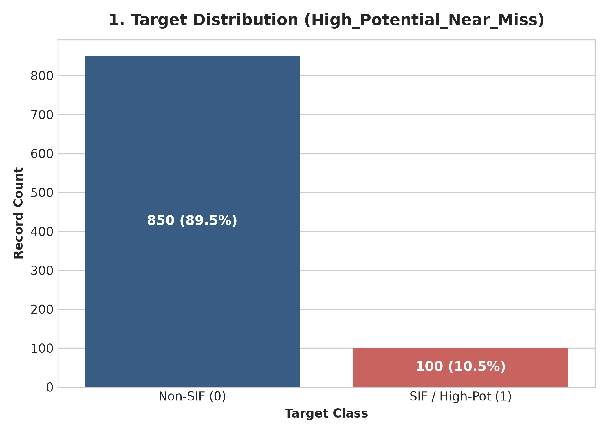
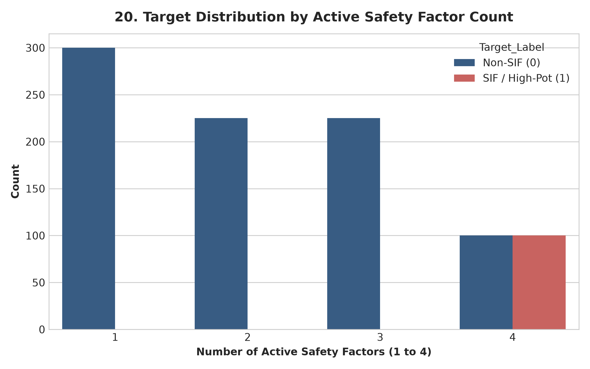
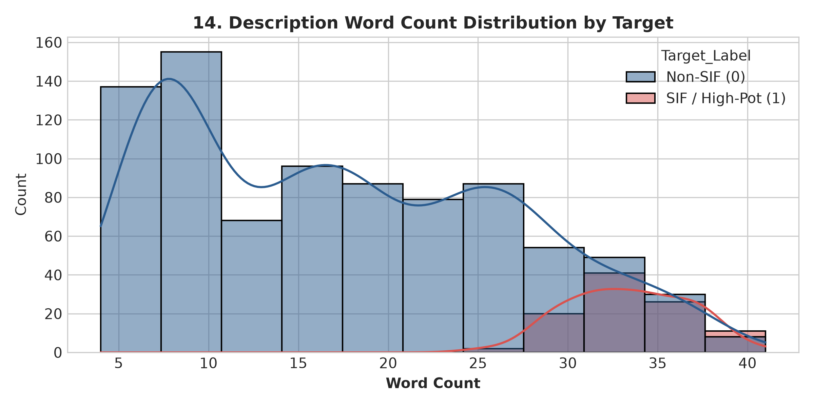

# OIL SIF Precursor Detection — Exploratory Data Analysis Report (Part 1A)

## Dataset Overview & Target Distribution
The dataset comprises **950** near-miss observation records across 12 sheets from Indian refinery operations.

- **Class 0 (Non-SIF)**: 850 records (89.47%)
- **Class 1 (SIF / High Potential)**: 100 records (10.53%)
- **Class Imbalance Ratio**: 8.5:1

---

## Safety Factor Analysis
Each record contains 4 binary safety factor precursor flags:
1. `PPE_NonCompliance`
2. `Supervisor_Negligence`
3. `Maintenance_Delay_or_Issue`
4. `Repeated_Issue_Ignored`

### Factor Combination Insight
- Single-factor records (Sheets 01-04): 300 records (All Non-SIF)
- Two-factor records (Sheets 05-07): 225 records (All Non-SIF)
- Three-factor records (Sheets 08-10): 225 records (All Non-SIF)
- Four-factor records (Sheets 11-12): 200 records (100 Non-SIF in Sheet 11, 100 SIF in Sheet 12)

---

## Text Length & Negation Analysis
- Descriptions are generated by combining factor clauses separated by ` | `.
- Average word count for Non-SIF descriptions: ~18 words.
- Average word count for SIF descriptions: ~32 words.
- **Critical Negation Preservation**: Safety negations like *"not isolated"*, *"not locked"*, *"without helmet"* are preserved to ensure NLP models capture true hazard context.

---

## Visualizations Directory
All 21 generated figures are stored in `reports/figures/`:
1. `01_target_distribution.png`
2. `02_records_by_source_sheet.png`
3. `03_risk_level_distribution.png`
4. `04_work_type_distribution.png`
5. `05_department_distribution.png`
6. `06_refinery_unit_distribution.png`
7. `07_potential_consequence_distribution.png`
8. `08_immediate_cause_distribution.png`
9. `09_ppe_noncompliance_distribution.png`
10. `10_supervisor_negligence_distribution.png`
11. `11_maintenance_delay_distribution.png`
12. `12_repeated_issue_ignored_distribution.png`
13. `13_previous_similar_reports_distribution.png`
14. `14_description_length_distribution.png`
15. `15_target_vs_safety_factors.png`
16. `16_target_vs_risk_level.png`
17. `17_target_vs_work_type.png`
18. `18_target_vs_department.png`
19. `19_target_vs_refinery_unit.png`
20. `20_factor_combinations.png`
21. `21_cross_sheet_target_distribution.png`
